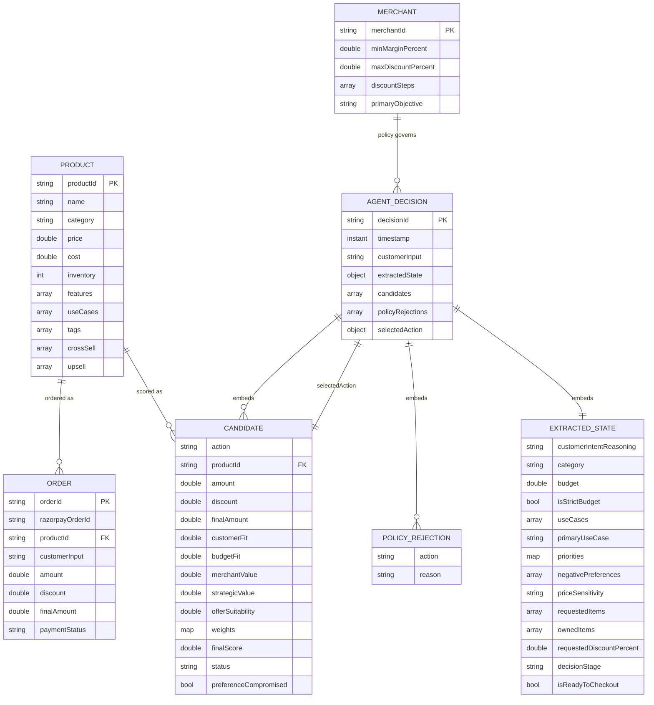
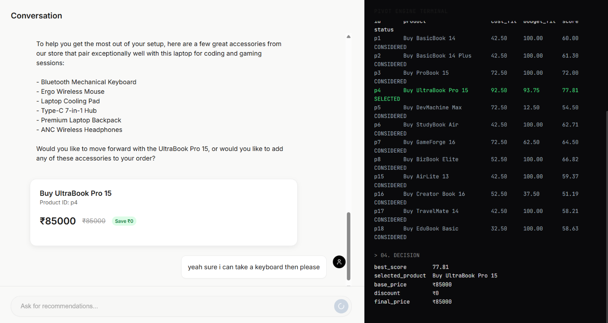
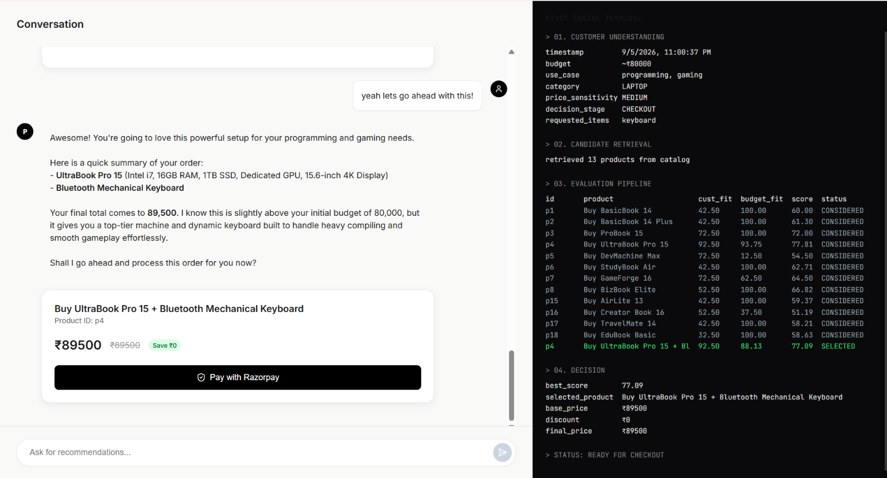
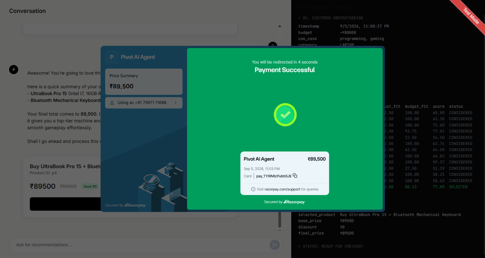

# PIVOT: AI Merchant Sales Agent

An AI sales agent that talks to customers in natural language but never decides what they pay - a deterministic policy engine and decision engine make every pricing, discount, and recommendation call in code, so every decision is auditable, not just narrated.

---

## Table of Contents
- [Why this exists](#why-this-exists)
- [How it works](#how-it-works)
- [Data Schema](#data-schema)
- [Screenshots](#screenshots)
- [Tech Stack](#tech-stack)
- [Razorpay Integration](#razorpay-integration)
- [Setup](#setup)
- [Project Structure](#project-structure)
- [What's implemented](#whats-implemented)
- [What I scoped out, and why](#what-i-scoped-out-and-why)
- [A bug I found and fixed](#a-bug-i-found-and-fixed)

---

## Why this exists

Most "AI sales agent" demos let the LLM decide prices and discounts directly. That's a real problem: it can hallucinate offers, ignore margin rules, or promise something the business never approved. PIVOT splits the job in two:

- **The LLM understands and phrases.** It extracts structured intent from free text (category, use case, budget, priorities) and later turns a decision into natural language. It never outputs a number that affects what the customer pays.
- **Deterministic code decides.** A policy engine hard-rejects anything commercially invalid (discount too high, margin too low, out of stock). A decision engine scores every valid option and picks the best one.

Every decision, including rejected candidates and the reason for each rejection, is stored and fully reconstructable.

---

## How it works

```
Customer message
   -> LLM extracts structured intent (no numbers)
   -> Candidate generator builds possible actions
   -> Policy engine hard-rejects invalid ones, logs why
   -> Decision engine scores the rest on 5 weighted factors
   -> Highest scoring candidate is selected
   -> LLM phrases the decision in natural language
   -> Customer confirms -> real Razorpay order, checkout, payment, webhook
   -> Full decision trace saved to agentDecisions
```

**Decision engine weights:**

| Factor | Weight | How it's computed |
|---|---|---|
| Customer Fit | 40% | Match between extracted state and product features/use cases |
| Budget Fit | 20% | How close the price lands to the stated budget |
| Merchant Value | 20% | Margin ratio, scaled |
| Strategic Value | 10% | Match against the merchant's stated objective |
| Offer Suitability | 10% | Rewards minimal valid discounts over larger ones |

**To try it yourself:** Ask the agent for a recommendation under a budget for a specific use case (e.g. *"I need a laptop for programming and gaming, budget around ₹60,000"*), respond to its follow-up questions, confirm the suggestion, and watch a real Razorpay checkout open.

---

## Data Schema

Four MongoDB collections. `ExtractedState`, `Candidate`, and `PolicyRejection` are embedded sub-documents inside `agentDecisions` (not separate collections). `Order.productId` and `Candidate.productId` are string references to `Product`.



---

## Screenshots

<!-- 1. Chat view mid-conversation with a product recommendation card -->
<!-- 2. The terminal/audit panel showing a full decision trace (candidates, scores, selected action) -->
<!-- 3. A policy rejection with its reason string visible -->
<!-- 4. Razorpay checkout modal open -->







---

## Tech Stack

- **Backend:** Spring Boot (Java), Spring AI
- **Database:** MongoDB
- **Frontend:** React + Vite
- **Payments:** Razorpay (Orders API, Standard Checkout, Webhooks) in test mode
- **LLM:** Gemini via Spring AI's structured-output `ChatClient`, used only for extraction and phrasing

---

## Razorpay Integration

Razorpay is the commercial backbone that makes the agent's decisions real, not just a payment gateway bolted on at the end.

| What | How |
|---|---|
| **Orders API** | Order amount is computed server-side from the stored `AgentDecision`, never passed from the frontend. The customer cannot tamper with what they pay. |
| **Standard Checkout** | Opened client-side using the server-issued Razorpay order ID and publishable key. |
| **Payment signature verification** | On `payment.success`, the backend verifies the HMAC-SHA256 signature (`razorpay_order_id + "\|" + razorpay_payment_id`) before updating any order status. |
| **Webhooks** | `payment.captured` event drives the canonical order status in MongoDB. The frontend result is treated as optimistic; the webhook is the source of truth. |

All of this runs in **Razorpay test mode**. No real money moves, but the full API contract is exercised end-to-end.

---

*Originally built for the Razorpay AI Buildathon (Track 01: AI Growth & Agentic Commerce).*

---

## Setup

### Prerequisites
- Java 17+
- Node.js 18+
- MongoDB instance (Atlas or local)
- Razorpay test-mode API keys
- Gemini API key

### Backend

```bash
cd backend
```

Create a `.env` file (or export as environment variables):

```env
AGENT_MONGODB_URI=your_mongodb_uri
GEMINI_API_KEY=your_gemini_key
RAZORPAY_KEY_ID=your_razorpay_test_key_id
RAZORPAY_KEY_SECRET=your_razorpay_test_key_secret
RAZORPAY_WEBHOOK_SECRET=your_webhook_secret
```

Run (Maven Wrapper is included, no separate Maven install needed):

```bash
./mvnw spring-boot:run
```

Backend starts on `http://localhost:8080` and seeds the database with sample products and a merchant policy on first startup.

### Frontend

No `.env` file needed. The proxy to `localhost:8080` is pre-configured in `vite.config.js`.

```bash
cd frontend
npm install
npm run dev
```

Frontend starts on `http://localhost:5173`.

---

## Project Structure

```
backend/
  src/main/java/com/pivot/agent/
    controllers/    -> ChatController, OrderController
    services/       -> ExtractionService, CandidateGeneratorService,
                        PolicyEngineService, DecisionEngineService,
                        ResponsePhrasingService, RazorpayService
    models/         -> Product, Merchant, Order, AgentDecision, ExtractedState
    dto/            -> ActionCandidate
    seed/           -> DatabaseSeeder (loads sample catalogue on startup)

frontend/
  src/
    components/     -> ChatBubble, MessageInput, RecommendationCard, TerminalLog
    services/       -> api.js
```

---

## What's implemented

- LLM-based intent extraction with a schema that structurally excludes any numeric scoring field
- Policy engine that hard-rejects invalid discounts, low margins, and out-of-stock items, with a logged reason for every rejection
- Decision engine that scores every surviving candidate live and picks `max(finalScore)`, never a hardcoded winner
- Full Razorpay test-mode flow: order amount computed server-side from the stored decision, signature verified, webhook drives the actual order status
- An audit/terminal panel in the frontend that renders the backend's decision trace directly, with no reformatting or invented numbers on the frontend

---

## What I scoped out, and why

I kept this deliberately narrow so the core claim (bounded, explainable, deterministic decisions) is fully provable, not just implied:

- **One merchant, one policy config.** The data model already supports more (`Merchant` is its own document keyed by `merchantId`), I just seeded one for the demo.
- **No persisted customer history.** Session state lives in memory, keyed by session ID, for the length of a conversation.
- **No learned or adaptive weights.** The five scoring weights are fixed constants for this prototype. The architecture supports swapping them for learned parameters later, but that's not a claim being made here.
- **No conversion probability modeling, no promotions/coupons, no merchant dashboard.** Out of scope for the build window, not because they're bad ideas.

---

## A bug I found and fixed

During live testing, I caught the phrasing LLM fabricating false justifications. If a customer asked for something (a discount, an add-on) that matched a real candidate the engine had scored but not selected, the LLM would claim it wasn't available at all and invent a plausible-sounding reason. I traced it to the phrasing step only knowing two outcomes (selected or not), so I added a third: **selected / rejected by policy / considered but outscored**. That's the exact failure mode my whole architecture is meant to prevent, and I found it myself before it became a problem.
